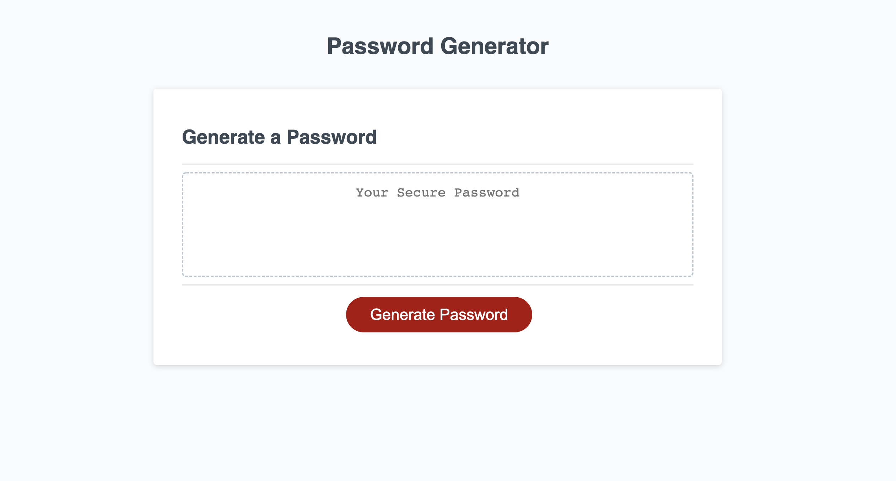

Challenge Title: 03 Random Password Generator using JavaScript

WHY DID I BUILD THIS PROJECT & WHAT PROBLEM DOES IT SOLVE: Building this page helps increase our JavaScript knowledge and skillset while coding an entire JS file on our own from the ground up. 

WHAT DID YOU LEARN: How to write JavaScript from scrach as well as a lot of practice troubleshooting and de-bugging when something doesn't perform as expected. 

Installation: This application can be accessed by following the below link
https://nelson92.github.io/challenge--3-code/

 

